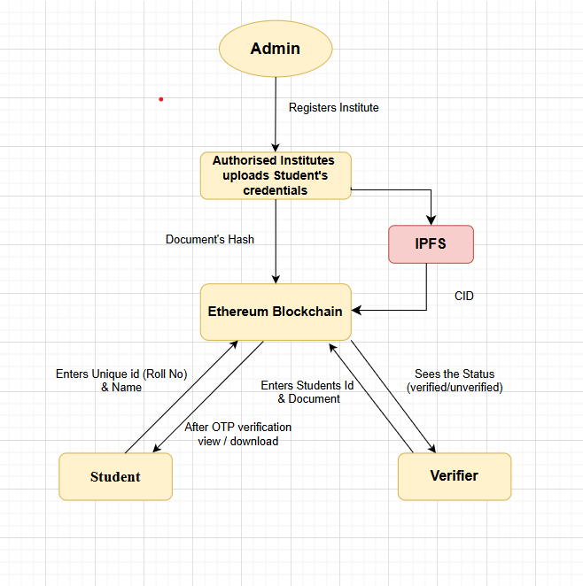

# InstaVerify :- Decentralized-Document-Verification-System
# Overview
InstaVerify is a document verification platform where you can upload and verify academic documents using blockchain. It ensures that the documents are genuine and can't be tampered later on. Once uploaded, the documents are stored securely and can be verified anytime.

# Flowchart

# Features
  •	**Blockchain-based verification :** Each uploaded document is hashed and stored on the Ethereum        blockchain, making the verification process secure and tamper-proof.
  
  •	**OTP-based user authentication :** A one-time password is sent to the student's email to ensure       that no one can access their credentials without their consent.
  
  •	Separate user dashboard for Institutes , Students and Employers
  
  •	**Verify Documents :** Employers can verify whether the student's credentials are genuine or not.
  
  •	**Clean and easy-to-use UI :** The user interface is designed to be simple and smooth, so anyone       can use it without confusion.
  
# Who can use ?
  •	**Universities :** Universities who are verified by Admin can issue student’s  certificates.
  
  •	**Students :**  Students can anytime access or share their documents after authentication.
  
  •	**Verifier :** After receiving certificates from students they can verify their  authenticity .
  
# Tech Stack
  •	**Frontend:** HTML, CSS, JavaScript
  
  •	**Backend:** Node.js, Express.js
  
  •	**Blockchain:** Solidity, Ethereum (Sepolia)
  
  •	**Smart Contract Interaction:** Ethers.js
  
  •	**OTP Authentication:** Nodemailer
  
  •	**File Storage:** IPFS via Pinata.
  
# Demo
 **RegisterInstitute**

  <video width="600" controls>
    <source src="https://user-images.githubusercontent.com/your-full-link.mp4](https://private-user-images.githubusercontent.com/219081995/462017552-27b0ec8e-6a2c-4d41-89f0-64a1ca2a34e3.mp4" type="video/mp4">
  </video>

  

  
  
